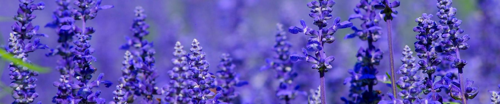
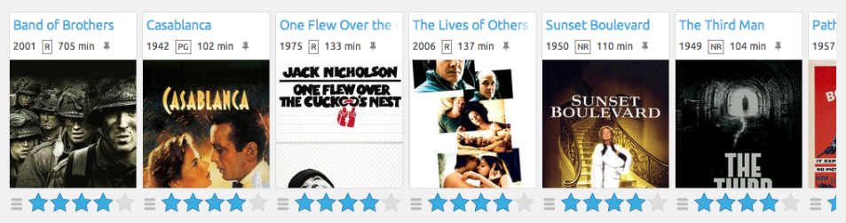

# [Correlation Analysis][ca]  

### Statistical Analysis Report  

Using statistical analysis to examine correlation between flower petal and sepal measurements  
Submitted in partial fulfillment of the requirements of the Statistical Analysis course at ITHS  

[ca]: https://github.com/Andreas-Svensson/Statistics/blob/main/project/report.md

# [Movie Recommendation System][mr]  

### Using Machine Learning to Recommend Movies

Designing, training, and testing a movie recommendation AI from scratch using data from MovieLens  
Once trained the user can enter a movie and get relevant recommendations based on it

[mr]: https://github.com/Andreas-Svensson/movie_recommender

# [Predicting Heart Disease](https://github.com/Andreas-Svensson/disease_prediction)

### Analysing Health Parameters to Detect Increased Risk of Cardiovascular Disease in Patients

Determining which parameters have a correlation with risk of heart disease  
Training multiple different AI models from scratch and systematically grading their usefulness for the task

